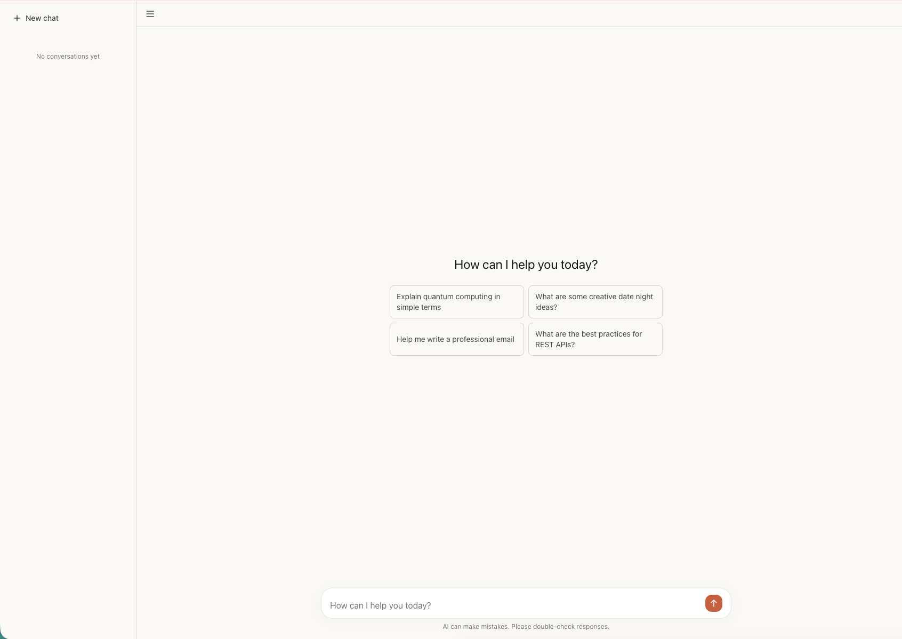

# Laravel AI SDK Chat

A ChatGPT-style chat interface built with the official [Laravel AI SDK](https://github.com/laravel/ai) and [Livewire](https://livewire.laravel.com). This is a reference implementation that accompanies a blog post, demonstrating how to build a streaming AI chat application using only PHP — no JavaScript frameworks required.



## Features

- **Real-time streaming responses** — AI responses stream token-by-token using Livewire's `wire:stream` with chunked transfer encoding
- **Conversation memory** — Full multi-turn conversation support using the SDK's `RemembersConversations` trait, persisted to the database
- **Multi-provider support** — Works with OpenAI, Anthropic, Gemini, Groq, Cohere, and any other provider supported by the Laravel AI SDK — just swap an env variable
- **Conversation sidebar** — Browse past conversations organized by date (Today, Yesterday, Previous 7 days, Previous 30 days, Older)
- **Markdown rendering** — Assistant responses are rendered as rich markdown with syntax highlighting via marked.js
- **Copy to clipboard** — One-click copy button on assistant messages
- **Responsive design** — Desktop sidebar with collapse toggle, mobile slide-out drawer
- **Suggestion chips** — Pre-configured prompt suggestions shown on empty conversations
- **Authentication** — Full auth scaffolding via Laravel Breeze with user-scoped conversations
- **Test coverage** — 24 PHPUnit tests covering chat functionality, streaming, conversation management, and user isolation

## Tech Stack

| Layer | Choice |
|-------|--------|
| Framework | Laravel 12 |
| AI | [laravel/ai](https://github.com/laravel/ai) (official Laravel AI SDK) |
| Frontend reactivity | Livewire 4 |
| Streaming | `wire:stream` (chunked transfer encoding) |
| Conversation memory | `RemembersConversations` trait + SDK migrations |
| Client-side markdown | marked.js |
| Styling | Tailwind CSS 3 |
| Auth scaffolding | Laravel Breeze (Blade stack) |
| JS interactivity | Alpine.js 3 |

## Project Structure

The core of the application is just 3 files:

```
app/Ai/Agents/ChatAssistant.php   — AI agent definition (19 lines)
app/Livewire/Chat.php             — Livewire component with all chat logic (184 lines)
resources/views/livewire/chat.blade.php — Chat UI template (258 lines)
```

Everything else is standard Laravel Breeze scaffolding for authentication.

## Local Setup

### Prerequisites

- PHP 8.2+
- Composer
- Node.js & npm
- An API key from at least one AI provider (OpenAI, Anthropic, etc.)

### Installation

```bash
# Clone the repository
git clone https://github.com/MujahidAbbas/laravel-ai-sdk-chat.git
cd laravel-ai-sdk-chat

# Install PHP dependencies
composer install

# Install frontend dependencies
npm install

# Copy environment file
cp .env.example .env

# Generate application key
php artisan key:generate

# Create SQLite database
touch database/database.sqlite

# Run migrations
php artisan migrate
```

### Configure Your AI Provider

Edit your `.env` file and set your preferred provider and API key:

```env
# Set the provider (openai, anthropic, gemini, groq, cohere, etc.)
AI_PROVIDER=openai

# Add your API key for the chosen provider
OPENAI_API_KEY=sk-...
# or
ANTHROPIC_API_KEY=sk-ant-...
```

### Run the Application

```bash
# Build frontend assets
npm run build

# Start the development server
php artisan serve
```

Or run everything together:

```bash
composer run dev
```

Then visit `http://localhost:8000`, register an account, and start chatting.

## Running Tests

```bash
# Run all tests
php artisan test

# Run only chat tests
php artisan test tests/Feature/Livewire/ChatTest.php
```

## Known Limitations

This is intentionally a minimal reference implementation. The following are **out of scope by design**:

- **No tool calling / function use** — The agent is a simple conversational assistant
- **No file uploads or attachments**
- **No conversation deletion or renaming**
- **No message editing or regeneration**
- **No typing indicators**
- **No rate limiting or token usage tracking**
- **No dark mode**
- **No retry on error** — If a response fails, the user must send a new message

### Production Deployment Notes

If deploying beyond local development:

- **Apache + PHP-FPM**: You may need to flush output buffers for streaming to work
- **Nginx**: Requires `proxy_buffering off;` and `X-Accel-Buffering: no` headers
- **Laravel Octane**: `wire:stream` is not supported — use `broadcastOnQueue()` with Reverb instead
- **Long responses**: The app sets `set_time_limit(300)` but you may need to tune `max_execution_time` for your setup

## Similar Projects

If you're exploring AI chat implementations in Laravel, check out these projects:

- **[laravel/larachat](https://github.com/laravel/larachat)** — Official Laravel AI chat demo using Inertia.js + React with the `useStream` hook
- **[pushpak1300/ai-chat](https://github.com/pushpak1300/ai-chat)** — AI chat starter kit using Prism PHP SDK, Inertia.js, and Vue.js
- **[theokafadaris/chatwire](https://github.com/theokafadaris/chatwire)** — Self-hosted ChatGPT clone built with Laravel and Livewire

This project differentiates itself by using the **official Laravel AI SDK** (`laravel/ai`) with **Livewire 4** for a pure PHP streaming experience — no React, Vue, or Inertia required.

## License

This project is open-sourced software licensed under the [MIT license](https://opensource.org/licenses/MIT).
